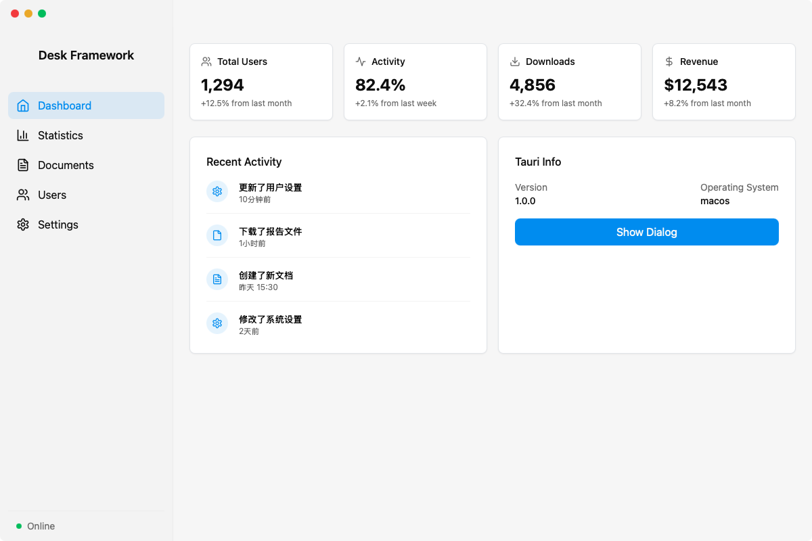
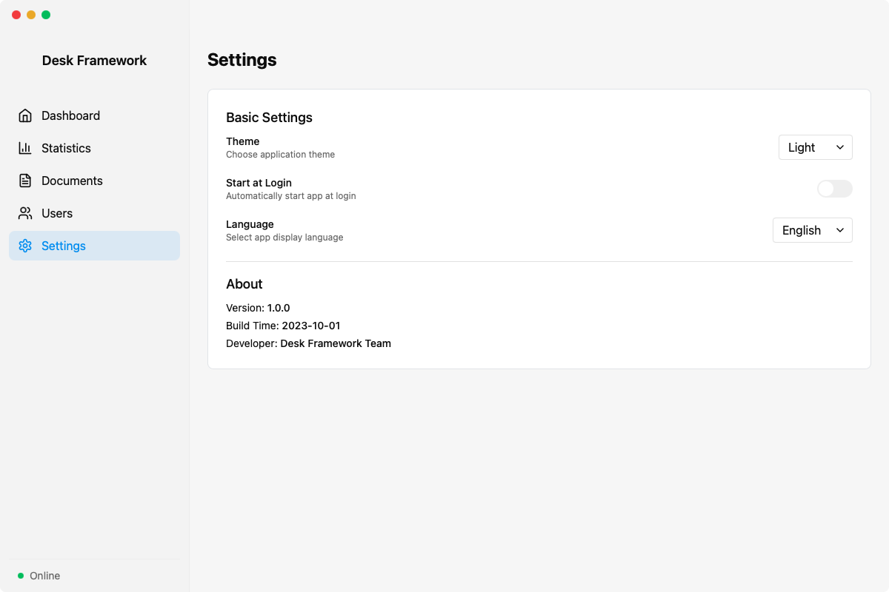

# Desk Framework

一个基于 Tauri + Vue 3 的现代桌面应用开发框架，集成了多种实用功能，让桌面应用开发变得简单高效。



## ✨ 功能特点

- 🖥️ **跨平台支持**：基于 Tauri，支持 Windows、macOS 和 Linux
- 🎨 **现代 UI**：使用 Tailwind CSS 构建的美观界面
- 🌙 **暗色模式**：支持浅色、深色和跟随系统的主题切换
- 🌐 **国际化**：内置中英文支持，易于扩展
- 🧩 **组件库**：丰富的预置 UI 组件
- 📊 **示例页面**：内置仪表盘、用户管理等示例页面
- 🔄 **状态管理**：集成 Pinia 进行状态管理
- 🛠️ **开发工具**：内置项目初始化工具

## 🚀 快速开始

### 先决条件

- [Node.js](https://nodejs.org/) (推荐 16.x 或更高版本)
- [Rust](https://www.rust-lang.org/tools/install)
- [Tauri 开发环境](https://tauri.app/v1/guides/getting-started/prerequisites)

### 安装

```bash
# 克隆仓库
git clone https://github.com/yourusername/desk-framework.git
cd desk-framework

# 安装依赖
npm install
```

### 开发

```bash
# 启动开发服务器
npm run tauri
```

### 构建

```bash
# 为当前平台构建
npm run tauri:build

# 为 Windows 构建
npm run tauri:build:win

# 为 macOS 构建
npm run tauri:build:mac
```

## 🔄 创建新项目

使用内置的项目初始化脚本快速创建一个新项目：

```bash
# 交互式创建
npm run init

# 或直接指定参数
npm run init "我的应用" "这是一个很棒的应用" "开发者名称" "com.example.myapp"
```

## 📁 项目结构
```
desk-framework/
├── dist/                    # 构建输出目录
├── scripts/                 # 工具脚本
│   └── init-project.js      # 项目初始化脚本
├── src/                     # 前端源代码
│   ├── assets/              # 静态资源
│   ├── components/          # Vue 组件
│   │   ├── ui/              # UI 组件
│   │   └── TitleBar.vue     # 自定义标题栏
│   ├── composables/         # Vue 组合式函数
│   ├── i18n/                # 国际化
│   │   └── locales/         # 语言包
│   ├── lib/                 # 工具库
│   ├── pages/               # 页面组件
│   ├── router/              # 路由配置
│   ├── store/               # Pinia 存储
│   ├── App.vue              # 应用根组件
│   ├── main.js              # 入口文件
│   └── style.css            # 全局样式
├── src-tauri/               # Tauri/Rust 源代码
│   ├── icons/               # 应用图标
│   ├── src/                 # Rust 源代码
│   │   ├── cmd/             # 命令模块
│   │   ├── lib.rs           # 库入口
│   │   └── main.rs          # 主函数
│   ├── Cargo.toml           # Rust 依赖配置
│   └── tauri.conf.json      # Tauri 配置
├── index.html               # HTML 入口
├── package.json             # npm 配置
├── postcss.config.js        # 
├── tailwind.config.js       # Tailwind CSS 配置
└── vite.config.js           # Vite 配置
```


## 🛠️ 主要技术栈
- 前端框架：Vue 3
- UI 框架：Tailwind CSS
- 路由：Vue Router
- 状态管理：Pinia
- 国际化：Vue I18n
- 图标：Lucide Icons
- 构建工具：Vite
- 桌面框架：Tauri

## 📋 功能列表
- ✅ 自定义标题栏（支持 Windows/macOS 不同风格）
- ✅ 暗色/浅色模式切换
- ✅ 国际化支持（中文/英文）
- ✅ 侧边栏导航
- ✅ 开机自启动设置
- ✅ 示例页面（仪表盘、统计、文档、用户、设置）
- ✅ 组件库

## 📝 自定义
主题颜色在 `src/style.css` 中定义，可以根据需要修改：
```
:root {
  --primary: 204 100% 48%; /* 修改主色调 */
  --background: 0 0% 100%; /* 修改背景色 */
  /* ... 其他颜色变量 */
}
```
添加新页面
1. 在 src/pages 目录中创建新页面组件
2. 在 src/router/index.js 中添加路由配置
3. 在 src/i18n/locales 中为新页面添加翻译


## 截图




## 📄 许可证
MIT

